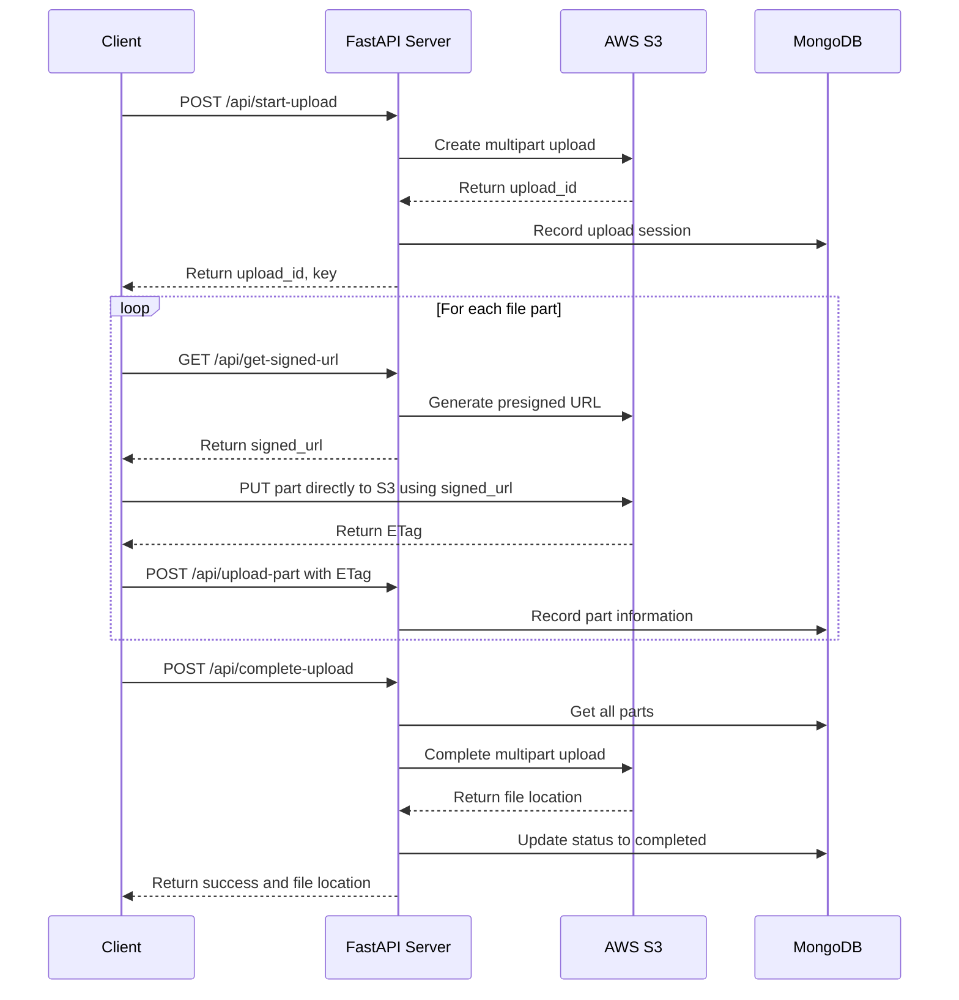

# S3 Multipart Upload API


A FastAPI application that facilitates multipart uploads to AWS S3 with MongoDB tracking.

## Flow Diagram



## Why FastAPI?

FastAPI was chosen for this project for several compelling reasons:

### Performance
- **High Speed**: FastAPI is one of the fastest Python frameworks available, with performance comparable to NodeJS and Go
- **Async Support**: Built on [Starlette](https://fastapi.tiangolo.com/features/#starlette-features) and leverages Python's async capabilities for handling concurrent requests efficiently, perfect for managing multiple upload sessions

### Developer Experience
- **Type Hints**: Uses Python's type annotations to provide automatic validation, editor support, and reduced bugs
- **Auto-Documentation**: Generates interactive API documentation (OpenAPI/Swagger) automatically, making testing and integration straightforward
- **Fast Development**: Reduces development time by approximately 200-300% compared to other frameworks

### S3 Integration
- **AWS SDK Compatibility**: Works seamlessly with boto3 for S3 operations
- **Async Support**: Handles concurrent S3 operations efficiently, crucial for multipart uploads

### Production Readiness
- **Validation**: Built-in request and response validation through Pydantic
- **Standards-Based**: Fully compatible with OpenAPI and JSON Schema standards
- **Dependency Injection**: Clean architecture for services like database connections

FastAPI's combination of performance, developer productivity, and built-in features makes it ideal for building robust APIs that handle complex workflows like S3 multipart uploads. To learn more about FastAPI, visit [FastAPI's official documentation](https://fastapi.tiangolo.com). If you want to learn more about FastAPI's robust feature base visit [here](https://fastapi.tiangolo.com/features/).

## Why MongoDB?

MongoDB was selected as the database for this project for several key reasons:

### Flexible Schema
- **Document Model**: MongoDB's document-oriented structure perfectly matches the variable metadata of upload sessions
- **Schema Evolution**: Adapt to changing requirements without migrations as upload tracking needs evolve
- **JSON-Like Documents**: Natural fit for storing upload metadata, part information, and status tracking

### Performance
- **Document-Level Concurrency**: Supports high-throughput operations with document-level locking, ideal for tracking many simultaneous uploads
- **Indexing**: Efficient querying of upload sessions by various attributes (user, status, date)
- **In-Memory Processing**: Fast access to active upload sessions with working set optimization

### Scalability
- **Horizontal Scaling**: Can easily scale out as upload volume grows through sharding
- **High Availability**: Replica sets provide redundancy and automatic failover for production reliability
- **No Downtime**: Add capacity without application disruption

### Developer Experience
- **Native Async Support**: Works seamlessly with FastAPI's async model through Motor driver
- **Intuitive API**: Simple, expressive query language reduces development time
- **Rich Ecosystem**: Comprehensive tooling for monitoring, backup, and management

MongoDB's combination of flexibility, performance, and scalability makes it particularly well-suited for tracking the state of multipart uploads, where sessions may last from minutes to hours and require persistent, queryable state management.

## Features

- Initialize multipart uploads to S3
- Generate pre-signed URLs for direct-to-S3 part uploads
- Track upload progress in MongoDB
- Complete multipart uploads by combining parts

## Prerequisites

- Python 3.8+
- MongoDB
- AWS S3 bucket and credentials

## Installation

1. Clone the repository:
   ```
   git clone https://github.com/yourusername/s3-multipart-upload-api.git
   cd s3-multipart-upload-api
   ```

2. Create a virtual environment:
   ```
   python -m venv venv
   source venv/bin/activate  # On Windows: venv\Scripts\activate
   ```

3. Install dependencies:
   ```
   pip install -r requirements.txt
   ```

4. Create a `.env` file with your configuration:
   ```
   AWS_REGION=your-region
   AWS_ACCESS_KEY_ID=your-access-key
   AWS_SECRET_ACCESS_KEY=your-secret-key
   S3_BUCKET_NAME=your-bucket-name
   MONGO_URI=mongodb://localhost:27017
   ```

## Running the Application

Start the FastAPI server:
```
uvicorn main:app --reload
```

The API will be available at http://127.0.0.1:8000

## Running with Docker

This project includes Docker configuration for easy deployment with containers.

### Prerequisites

- Docker and Docker Compose installed on your system
- AWS S3 bucket and credentials

### Setup

1. Create a `.env` file in the project root with your AWS credentials:
   ```
   AWS_REGION=your-region
   AWS_ACCESS_KEY_ID=your-access-key
   AWS_SECRET_ACCESS_KEY=your-secret-key
   S3_BUCKET_NAME=your-bucket-name
   ```

2. Build and start the containers:
   ```
   docker compose up --build
   ```

3. The API will be available at http://localhost:8000

### Docker Components

- **API Container**: Runs the FastAPI application
- **MongoDB Container**: Provides the database for tracking uploads
- **Volumes**: Persistent storage for MongoDB data

### Development with Docker

The Docker setup includes volume mapping for the application code, allowing you to make changes without rebuilding the container. The server will automatically reload when code changes are detected.

To stop the containers:
```
docker compose down
```

To remove volumes when stopping:
```
docker compose down -v
```

## API Endpoints

- `POST /api/start-upload` - Initialize a multipart upload
- `GET /api/get-signed-url` - Get a pre-signed URL for part upload
- `POST /api/upload-part` - Record a successfully uploaded part
- `POST /api/complete-upload` - Complete the multipart upload

## Testing

Use the included `test_main.http` file with REST Client for VS Code or similar tools to test the API endpoints.

## License

MIT
