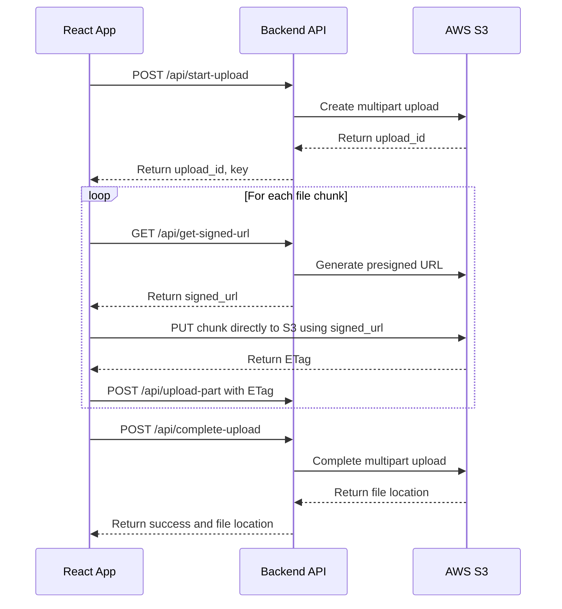

# React S3 Multipart Uploader


A React application that enables efficient large file uploads to AWS S3 using multipart upload with signed URLs.

## Flow Diagram



## Why React + TypeScript + Vite?

This frontend stack was chosen for several compelling reasons:

### Performance
- **Fast Development**: Vite provides lightning-fast HMR (Hot Module Replacement)
- **Optimized Build**: Produces highly optimized production builds with tree-shaking
- **Efficient Rendering**: React's virtual DOM minimizes expensive DOM operations

### Developer Experience
- **Type Safety**: TypeScript catches errors at compile time rather than runtime
- **Component Reusability**: React's component-based architecture promotes code reuse
- **Modern Tooling**: ESLint integration for code quality and consistency

### S3 Integration
- **Chunk Management**: Efficiently handles file chunking for multipart uploads
- **Progress Tracking**: Real-time upload progress with cancelation support
- **Direct-to-S3**: Uses signed URLs for secure direct uploads to S3

## Features

- Upload large files (>5GB) to S3 using multipart upload
- Real-time progress tracking
- Resumable uploads (coming soon)
- Direct-to-S3 uploads using pre-signed URLs
- Responsive UI with progress indicators

## Prerequisites

- Node.js 18+
- Backend API for S3 signed URL generation
- AWS S3 bucket configured for CORS

## Installation

1. Clone the repository:
   ```
   git clone https://github.com/yourusername/react-s3-multipart-uploader.git
   cd react-s3-multipart-uploader
   ```

2. Install dependencies:
   ```
   pnpm install
   ```

3. Create a `.env` file with your configuration:
   ```
   VITE_API_BASE_URL=http://localhost:4000/api
   ```

## Running the Application

Start the development server:
```
pnpm dev
```

The application will be available at http://localhost:3000

Build for production:
```
pnpm build
```

Preview the production build:
```
pnpm preview
```

## Running with Docker

This project includes Docker configuration for easy deployment with containers.

### Prerequisites

- Docker and Docker Compose installed on your system
- Backend API for S3 signed URL generation

### Setup

1. Build and start the container:
   ```
   docker compose up --build
   ```

2. The application will be available at http://localhost:80

### Docker Components

- **Frontend Container**: Builds the React application and serves it with Nginx
- **Environment Variables**: Configure API endpoints through Docker Compose

To stop the container:
```
docker compose down
```

## Configuration

The application can be configured through environment variables:

- `VITE_API_BASE_URL`: URL of the backend API (default: http://localhost:4000/api)

## How It Works

1. The user selects a file for upload
2. The application divides the file into chunks (default: 10MB)
3. For each chunk:
	- Requests a signed URL from the backend
	- Uploads the chunk directly to S3 using the signed URL
	- Reports progress to the user
4. After all chunks are uploaded, the application requests the backend to complete the multipart upload
5. The user receives a link to the uploaded file

## License

MIT
